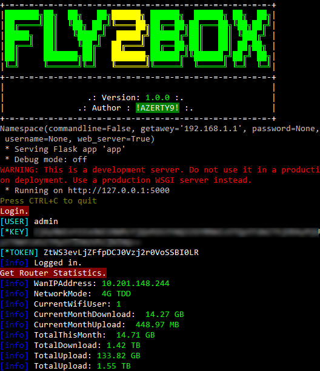

# Fly2Box WAN IP Changer

## Overview

**Fly2Box** is a Flask web application that allows you to request a new WAN IP address from a **HUAWEI 4G Router API** by changing network bands from 4G FDD to 4G TDD and vice versa. It also provides a simple command-line interface (CLI) for controlling the web application.

#### List of HUAWEI 4G Router Models:
##### Device name:
* B612-233
* B618s-22d
* B715s-23c
* B525s-65a
* B525s-23a


## Requirements

Before running the script, ensure you have the following dependencies installed:

- [Colorama](https://pypi.org/project/colorama/): For terminal color output.
- [Requests](https://pypi.org/project/requests/): For making HTTP requests.
- [Flask](https://pypi.org/project/Flask/): For building the web application.
- [argparse](https://pypi.org/project/argparse/): For user friendly command line interfaces.
You can install these dependencies using pip:

```bash
pip install colorama requests flask argparse
```

## Installation

To install Fly2Box, simply clone the repository by runing the following command:
```bash
git clone https://github.com/az3rty9/fly2box/
```
or Download this repository.

## Usage

```bash
cd fly2box
```
### Command-Line Interface (CLI)
To start the script with the CLI, use the following command:
```bash
python script.py -cli -u admin -p pa$$w0rd (optionally: -g 192.168.1.1)
```
This will launch the script in CLI mode, where you can control the WAN IP changing process.

### Web Interface
To start the script with the web interface, use the following command:
```bash
python script.py -web
```
This will start a Flask web application that allows you to interact with the WAN IP changer through a web browser.

## Usage Instructions
Run the script with either the CLI or web interface mode as shown above.
Access the web interface by opening your web browser and navigating to ```http://localhost:5000``` (or another specified address).
Follow the on-screen instructions to change the network band and request a new WAN IP address.


## Screenshots
 



## License
This project is licensed under the MIT License - see the LICENSE file for details.

